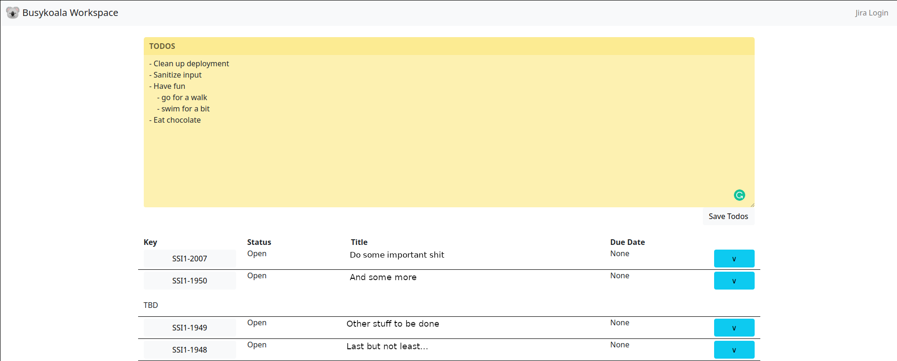

# Jira Manager

The current app lists your issues which are not yet done. It should be a
clutter free overview of things to do with only the most important features.



## Getting Started

### App setup

```
# copy .env.example to .env and add your details

# install dependencies
poetry install

# run app
poetry run python app/main.py
```

### How to use

To allow super enterprisy setups with two factor auth the login is done
manually in a Selenium test browser to retrieve the cookies for the api requests.

## Future Plans

For the future I'd like to add the most important actions for the issues like
putting them to `implementation` and `done`.

Other than that I might add some more filtering queries to choose from instead
of only having the `not done` ones.
